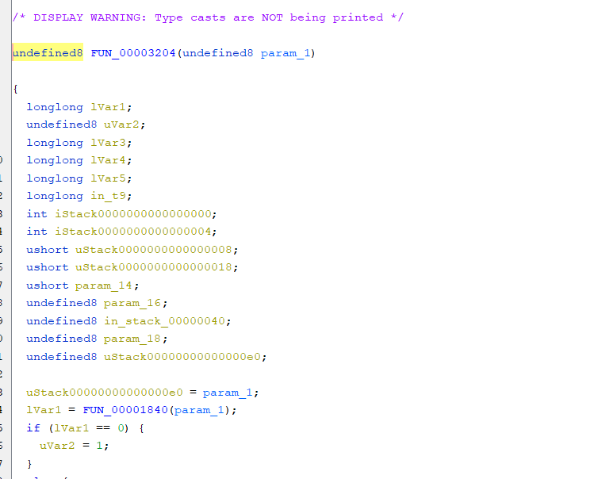
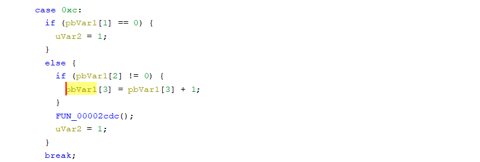

### 饶派杯 XCTF 车联网挑战赛 mqttsvr 复现

#### 前言

IDA和Ghidra对**mips64**架构的识别貌似不是很友好，赛场上由于反编译实在难看，所以很难静下心来去逆，于是赛后在期末考试前稍微花点时间做了一下复现。

#### 准备

**checksec**一下，发现是**mips64 大端**，没开**Canary RELRO**，可以溢出，可以覆写**got表**，这里开了**NX和PIE**，**NX**对**mips64**这种异架构来说好像并不会起作用，如果服务端是用**qemu**起的，**PIE**好像也啥作用。


把文件拖进**IDA**分析，发现我的**IDA**根本反编译不了。


拖进**ghidra**分析，乍看起来貌似并没有什么问题，仔细看一下会发现少了很多函数。


这可能是由于**ghidra**基址识别错误导致的，于是我们把**ghidra**的加载地址由**0x100000**改为**0x0**，可以得到较为全面的反编译。

#### 逆向分析

从题目名字**mqttsvr**大概就能猜到这题基于**mqtt协议**，不过赛场上不能联网，不知道**mqtt**协议的大致格式，纯靠逆向就很难受了，复现的时候可以上网查查，感觉还可以。一开始会分配一个堆块，然后进入一个循环，这个堆块后来可以知道是存放标志位用的。


函数**FUN_000042fc**比较长，容易关注到其中的**switch**，这个操作是对某个字节右移4，也就是取了该字节的高**bit**位，来作为选择项。通过以下**mqtt Connect**报文，可大概推断这个**switch**就是判断报文的不同类型的请求，并且给出相对应的处理。那么漏洞大概率就存在这些请求的处理函数中。

```
0x10             // 固定报头：报文类型（Connect）和保留标志位
0x0C             // 可变报头长度
0x00 0x04 0x4D 0x51 0x54 0x54 // MQTT协议名称（长度为4）
0x05             // MQTT协议版本号
0xCE             // 连接标志
0x00 0x3C        // Keep Alive时间（以秒为单位，此处为60秒）

// 有效载荷
0x00 0x04 0x63 0x6C 0x69 0x65  // 客户端标识符（Client Identifier）
0x00 0x0A 0x2F 0x75 0x73 0x65 0x72 0x73 0x2F 0x31 0x32 0x33 // 遗嘱主题（Will Topic）
0x00 0x06 0x77 0x69 0x6C 0x6C 0x2F 0x31  // 遗嘱消息（Will Message）
0x00 0x04 0x75 0x73 0x65 0x72  // 用户名（Username）
0x00 0x06 0x70 0x61 0x73 0x73 0x77 0x6F  // 密码（Password）
```


并且我们不难发现除了**case 1**，其他在进入处理函数前，都会有一个**pbVar1[1] == 0**的判断，猜测这里的**case 1**是一个连接认证的请求。直接进入**FUN_00003200**看一下，但是发现**ghidra**识别不出这个函数。


我这里采用的方法是，直接到**0x3200+0x4**的地方，直接强行创建一个函数，发现可以识别出来。还是有少许函数调用识别不出来，对着汇编看看就行。




**FUN_00003200**函数大概流程是，获取客户端标识符，用户名和密码并对其进行检查。这里的客户端标识符和用户名经过简单逆向可知应该分别为**Car_MQTT_Client和Car_Administrator**。对于用户密码来说，在获取到密码之后会经过**FUN_000049f0，FUN_00004a68，FUN_00004c84**进行处理。进入函数内部看一下，可以得知实现了一个**md5**加密，同时把加密之后的数据，通过**strncmp**与**'\x64\x1C\x73\x9C\x22\xC8\xF5\xC0\x67\xE1\x1F\xC3\x0B\xEC\x9D\x7A'**循环异或**0x73**进行比较，这里可以发现，第三位会出现**\x00**截断，故这里可以通过爆破，得到一个加密后前3字节为**\x17\x6f\x00**的密码即可，我这里爆破出一个**\x00\xDD\x5E\x85**。发送如下报文即可成功连接。

```python
# Connect
sleep(0.1)
s.send(b'\x10' + b'\x34')

VariableHeader = b'\x00\x04MQTT' + b'\x04\xC2' + b'\x43\x21' # \x04 + MQTT + \x04\x02 + \x43\x21
VariableHeader+= b'\x00\x0F' + b'Car_MQTT_Client'
VariableHeader+= b'\x00\x11' + b'Car_Administrator'
VariableHeader+= b'\x00\x04' + b'\x00\xDD\x5E\x85'

# Subscribe 1
sleep(0.1)
s.send(VariableHeader)
```


接下来分析**case 3**的函数**FUN_000039b0**，一开始有一大堆的函数，其中也有**memcmp**来进行判断，不过这里不太好看出来是和什么进行的比较，我去调试了一下，可以知道是与**IOTcar_topic**进行比较，这些数据会用全局变量**null_ARRAY_00017360**来存放其指针进行保存，同时最后会进入函数**FUN_000037d8**。


函数**FUN_000037d8**中也有一些**memcmp**，并且可以很清楚得之是与什么进行的比较。


可以发现，一个字段是与**IOTcar_topic**，另一个是与**car_car**进行比较，并且如果*** (calloc_ptr+ 2) == '\x01'，*(calloc_ptr+ 3) == '\x05'**，那么就可以进入函数**FUN_0000250c**，并且上面把**null_ARRAY_00017360 + local_30 * 0x20 + 0x13**（存放字段car_car的堆地址）拷贝到**acStack_48**上。后期经过调试得知**FUN_0000250c**本意可能是用来泄露出一个堆地址，不过由于我这里是**qemu启动**的原因，堆地址都是**0x4000018000**，会出现**\x00**截断的问题，不知道远程是不是用其他方式启动的，还是我的启动方式的原因。不过这里的*** (calloc_ptr+ 2) == '\x01'，*(calloc_ptr+ 3) == '\x05'**还并不满足，我们需要对其他函数进一步分析。


**case 5，6**的处理函数比较简单，同时并没有起到什么作用，故分析略过。

**case 8**的函数**FUN_00003dfc**中，可以很明显看出有一个堆溢出漏洞，它在申请堆块时，**malloc_size=(size&0xff)**，并且如果其中的一个字段等于**IOTcar_topic**，就会把*** (calloc_ptr+ 2)**的值设置为**1**，这是泄露堆地址的条件之一。


**case 10**的功能是吧**case 8**申请的堆块释放掉，并且把*** (calloc_ptr+ 2)**的值设置为**0**。**case 12**的功能是使得 ***(calloc_ptr+ 3) = *(calloc_ptr+ 3)+1**，通过发五次这个请求包可以满足***(calloc_ptr+ 3) == '\x05'**。




#### 漏洞分析

这题的漏洞有如下几个。第一个是在连接时，用户密码由于**md5**之后存在**\x00**截断的问题，故可以爆破出一个满足条件的密码。第二个是订阅**IOTcar_topic**主题，并且发送5次**\xC0**开头的请求，再发送特定的消息即可泄露堆地址。第三个是存在一个堆溢出。


#### 漏洞利用

泄露出堆地址之后，就可以得到程序基地址。可以劫持**got**表，并且**NX**没有效果，那么我们就可以把**malloc等函数**的**got**表改为某一个堆地址，并且在这个堆地址上写入**shellcode**即可。**uclibc mips64**的堆利用我参考这篇文章（https://eqqie.cn/index.php/search/mips64），发现有三个不同的malloc版本。但我并不知道怎么判断当前**uclibc**是哪一个版本，我就用**malloc-standard**这个版本的利用方法试了一下，直接覆盖一个杯释放堆块的**fd**，发现二次分配，可以申请到预期位置（malloc_got - 0x20）。


覆盖成**shellcode**地址之后，我们即可执行提前布置好的**shellcode**，从下图可见我们成功跳转到我们提前布置的**shellcode**上，不过虽然最后我可以走到**execve("/bin/sh", NULL, NULL)**，但是似乎系统调用并没起作用。有知道原因的师傅可以联系我一下，我再改一下这里。


